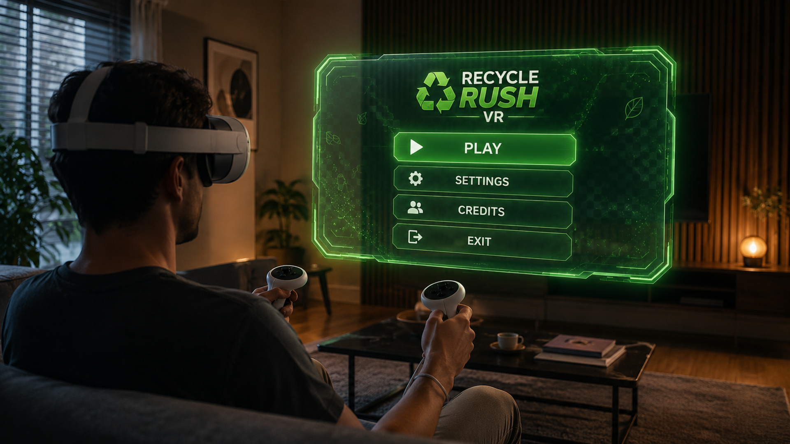
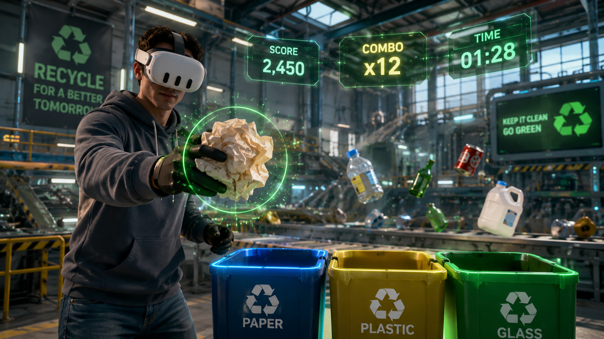
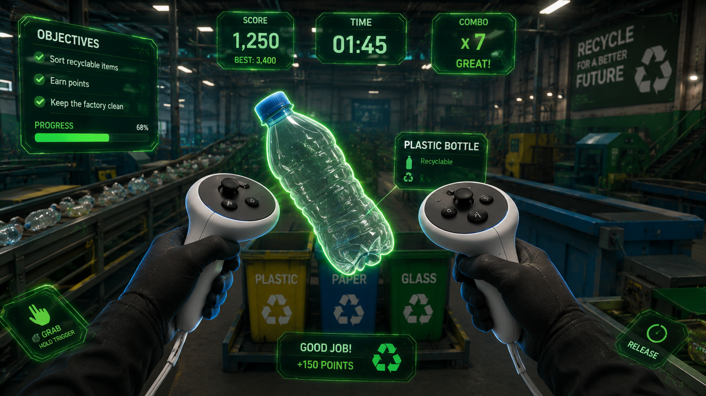
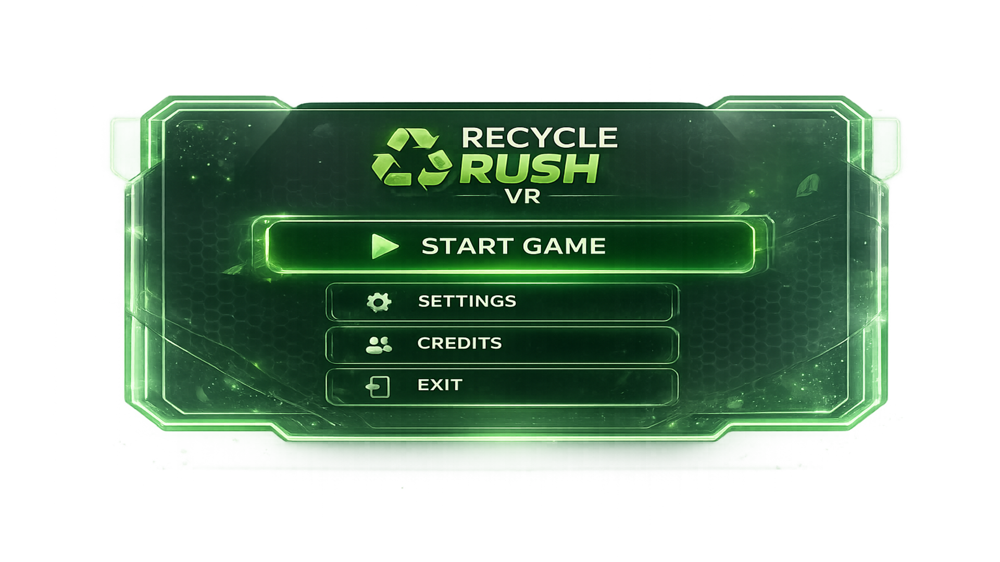
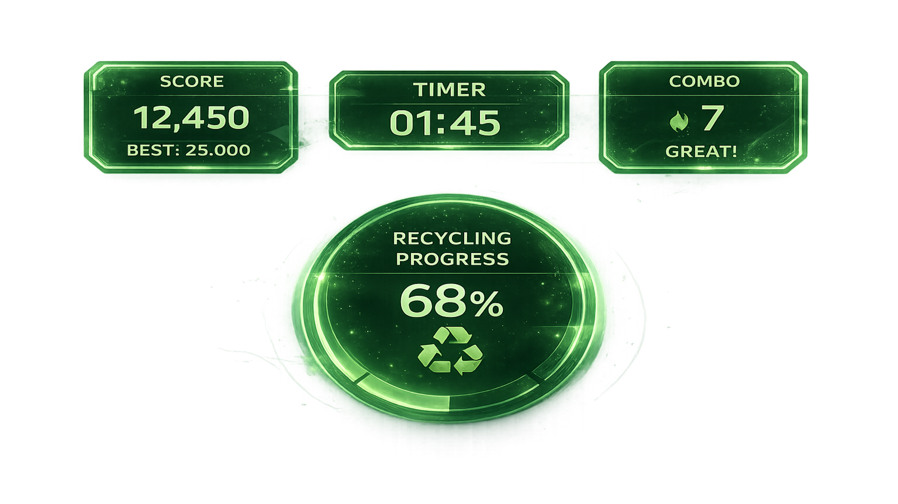
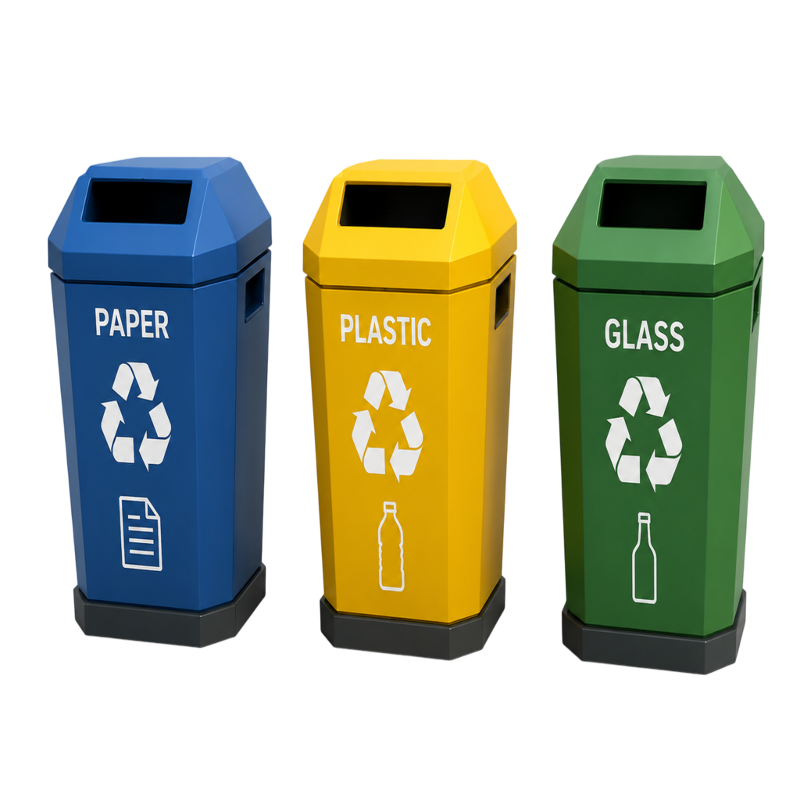
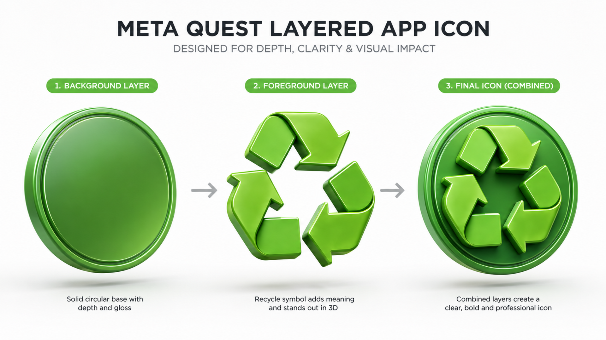

# Recycle Rush VR

Recycle Rush VR is a virtual reality game designed to teach recycling through immersive gameplay on Meta Quest.

---

## Project Overview

Recycle Rush VR allows players to identify and recycle waste objects inside a VR environment while learning correct recycling habits.

---

## Features

- ♻️ Recycling gameplay
- 🥽 Meta Quest VR support
- 🎮 Immersive interaction
- 🟢 Layered App Icon design
- ✨ Parallax-ready logo concept

---

## Implementation Plan

Project implementation details can be found here:

[Implementation Plan](docs/implementation_plan.md)

---

## Layered Logo

### Background

### Foreground

### Preview

---

## VR Mockup

---

## Additional Mockups

### Main Menu Mockup

A concept showing how the Recycle Rush VR main menu may appear inside the Meta Quest environment.

---

### Gameplay Mockup

A concept visualization of the player sorting recyclable waste into the correct recycling bins.

---

### Controller Interaction

Example of XR grab interaction using Meta Quest Touch Plus controllers.

---

## User Interface Concepts

### Main Menu UI

### Gameplay HUD

---

## Game Assets

### Recycling Bins

Low-poly recycling bins used in the game environment.

---

## Layered App Icon Structure

Concept presentation showing the background layer, foreground layer and the assembled Meta Quest application icon.

