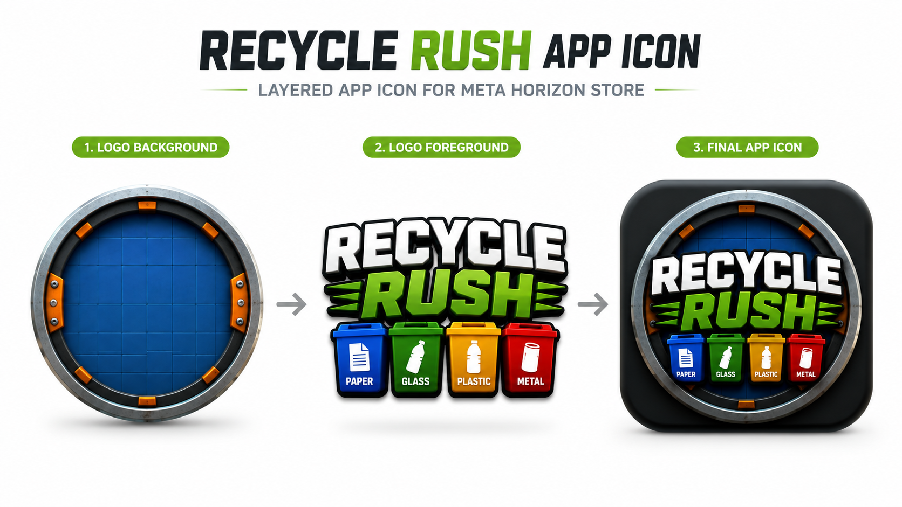

# ♻️ Recycle Rush VR

  
   
  <i>An educational Virtual Reality experience designed to teach correct recycling habits through immersive, physics-based gameplay on Meta Quest.</i>

---

## 📖 Project Overview

**Recycle Rush VR** is an interactive, fast-paced virtual reality game developed for the Meta Quest platform. The primary objective is to educate players on environmental sustainability and proper waste sorting. Players are challenged to identify, grab, and correctly categorize various types of waste (Paper, Glass, Plastic, Metal) moving along a dynamic conveyor belt into their respective recycling bins.

This project was developed with a strong focus on **performance optimization, scalable software architecture, and immersive XR interactions**, making it an excellent showcase of professional Unity VR development practices.

---

## 🎥 Gameplay Trailer

[> 📹 **Watch the Recycle Rush VR Gameplay Trailer on YouTube**](https://youtu.be/2mVESY8Hb2Q)

---

## 🎮 Key Features

- **Immersive XR Interactions:** Fully utilizes Unity's XR Interaction Toolkit (XRI) for natural grabbing, throwing, and physical manipulation of objects.
- **Interactive VR Menus:** Fully diegetic, physical VR UI panels featuring interactable Play, Settings, and Exit buttons, along with a comprehensive Game Over screen.
- **Dynamic Difficulty Scaling:** The game progressively speeds up the conveyor belt and spawn rates, adapting to the player's skill level.
- **Multisensory Feedback:** Integrated spatial audio and haptic controller feedback to reward correct actions and alert on mistakes.
- **Educational AI Drone:** A companion drone governed by a Finite State Machine (FSM) that reacts to the player's gameplay state (Happy, Sad, Idle).
- **Fair-Play Penalty System:** Advanced collision and raycast detection to penalize players for dropping waste, while smartly exempting items currently traveling on the belt.

---

## ⚙️ Technical Architecture & Engineering

To ensure a smooth VR experience at high framerates (90+ FPS), the project implements several advanced software engineering patterns:

### 1. High-Performance Object Pooling (`ObjectPoolManager`)
VR games on mobile chipsets are highly sensitive to memory allocation spikes (Garbage Collection stutter). To solve this:
- **Zero-Allocation Spawning:** Waste objects are pre-instantiated and recycled using a robust Queue-based pooling system instead of being instantiated/destroyed at runtime.
- **Fuzzy Tag Matching:** Flexible dictionary lookups allow seamless handling of different prefab variants.
- **Physics Stabilization & Kill-Z:** Implemented `maxDepenetrationVelocity` to prevent physics "explosions" when objects spawn densely. A custom `Kill-Z` and boundary tracking algorithm automatically culls objects that escape the play area, ensuring optimal scene performance and preventing memory leaks.

### 2. Event-Driven Architecture
The game relies heavily on C# `Action` and `delegate` events to maintain a decoupled, modular codebase:
- Systems like `ScoreManager`, `DifficultyManager`, and `GameManager` communicate entirely through events (e.g., `OnWasteMissedFloor`, `OnDifficultyLevelChanged`).
- This prevents "Spaghetti Code" and strict dependencies, making the project highly scalable and easy to test.

### 3. Advanced Physics & Collision Handling (`WasteSpawner` & `FloorZone`)
- **Safe Spawning:** The `WasteSpawner` uses `Physics.OverlapSphere` to mathematically guarantee the spawn area is clear before initializing a new object, preventing catastrophic physics overlaps.
- **Smart Ground Detection:** The `FloorZone` script utilizes a combination of Raycasting and OverlapSphere checking to differentiate between "waste sitting on the moving belt" and "waste dropped on the floor", ensuring the 3-second penalty timer is completely fair.

---

## 🚀 Getting Started

### Prerequisites
- **Unity Engine:** 6.3 LTS (6000.3.19f1) or newer.
- **XR Plugin Management:** OpenXR configured for Android/Meta Quest.
- **Hardware:** Meta Quest 2, Pro, or 3 (or compatible PC VR setup via Quest Link).

### Installation
1. Clone the repository: `git clone https://github.com/Emresatil/Recycle-Rush-VR.git`
2. Open the project in Unity Hub.
3. Open the main scene located at `Assets/_App/Scenes/MainGame.unity`.
4. Press **Play** (Ensure your VR headset is connected via Link, or build the `.apk` directly to the headset).

---

## 🎨 Visual Assets & Concepts

*(The following sections showcase the UI/UX and Asset design process for the project).*

### Layered App Icon Structure
Concept presentation showing the background layer, foreground layer and the assembled Meta Quest application icon.

## 👥 The Team

- **Hakan Uzer** - [LinkedIn](https://www.linkedin.com/in/hakanuzer/)
- **Emre Satıl** - [LinkedIn](https://www.linkedin.com/in/emresatil/)

---

  <b>Developed with 💚 for a cleaner future.</b>

