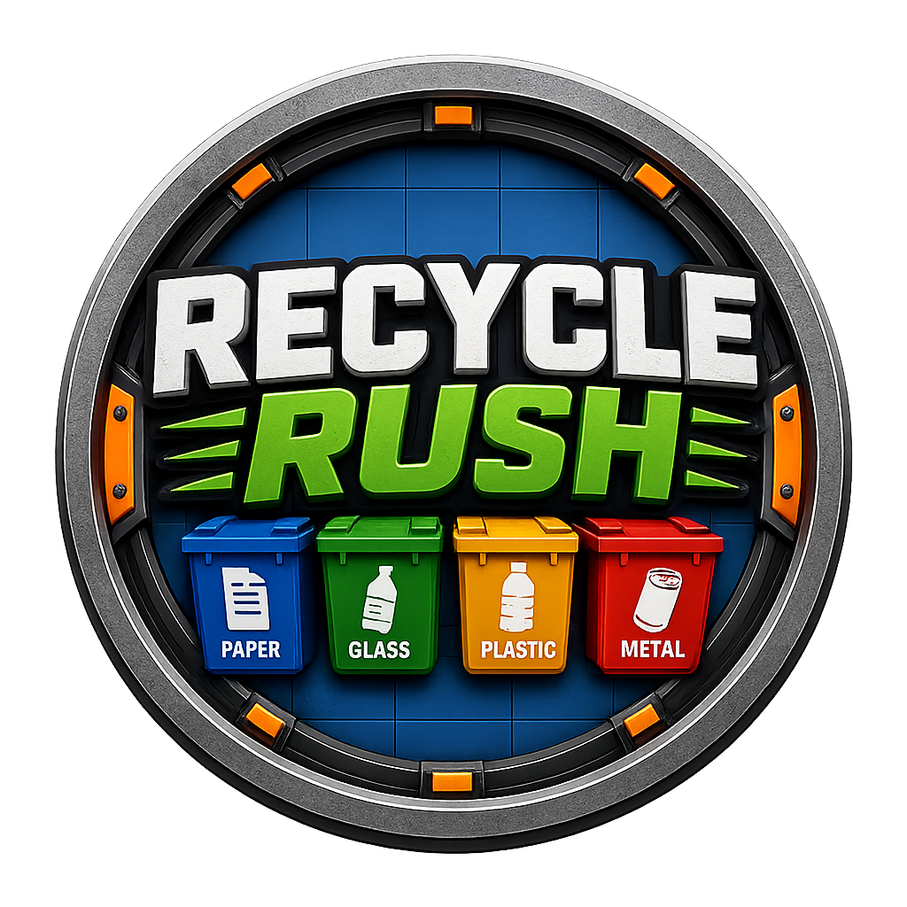

# ♻️ Recycle Rush MR (Mixed Reality / AR)

<div align="center">
  
  <br/>
  <i>An immersive Augmented / Mixed Reality recycling simulator that transforms the player's physical room into an arcade recycling playground on Meta Quest.</i>
</div>

---

## 📖 Project Overview

**Recycle Rush MR** is an interactive, fast-paced Mixed Reality (MR/AR) game developed for Meta Quest (Passthrough) devices. Transitioning from the original VR conveyor-belt mechanics, **Recycle Rush MR** brings the arcade recycling experience directly into the player's real-world living space.

Using Meta Quest's **Passthrough camera system**, virtual recycling portals open on the player's ceiling, dropping various types of waste (Paper, Glass, Plastic) into their actual room. Players physically walk around their room, grab items off their floor, and throw them into spatial recycling bins positioned around their real environment.

Featuring **15 balanced difficulty levels**, a **JSON Save System**, **XP & Coin economy**, **Golden Waste surprises**, **6 dynamic random events**, and **achievements**, Recycle Rush MR delivers high replayability while teaching environmental sustainability.

---

## 🎮 Key Features

- **Real-World Passthrough & Spatial Anchors:** Seamlessly overlays virtual game elements (bins, portals, VFX) onto the player's real room environment using Meta XR SDK.
- **Physical Room Exploration:** Players physically stand up, move, and throw items in their real-world space, replacing mechanical conveyor belts with physical interaction.
- **15-Level Progression & Balancing:** A mathematical difficulty curve featuring increasing portal drop rates, higher Golden Waste odds, and level-specific missions.
- **Surprise Golden Waste:** Special rare items (%5 to %25 chance) that grant bonus points, high XP, and massive Coin rewards upon correct sorting.
- **6 Dynamic Random Events:** Spontaneous gameplay modifiers including *Speed Mode*, *Double Coin*, *Lucky Drop*, *Slow Motion*, *Double XP*, and *Mega Combo*.
- **JSON Profile Save System:** Persistent save data (`Application.persistentDataPath`) storing level unlocks, total XP, Coin balance, high scores, and achievement progress.
- **Diegetic Wrist & 3D Floating UI:** Spatial 3D UI panels floating seamlessly in the physical environment, including a wrist-mounted Pause menu.
- **Multisensory Feedback:** Integrated spatial 3D audio cues and tailored Quest haptic controller feedback for grabs, throws, combos, and Golden Waste drops.

---

## ⚙️ Technical Architecture & Engineering

The project is built on clean software architecture patterns engineered for mobile MR performance (72+ FPS on Meta Quest hardware):

```text
                      ┌──────────────────────┐
                      │    WasteSpawner      │
                      └──────────┬───────────┘
                                 │ Item Spawned (Normal or Golden %5-%25)
                                 ▼
                      ┌──────────────────────┐
                      │    WasteItem /       │
                      │    GoldenWaste       │
                      └──────────┬───────────┘
                                 │ Player Throws into Bin
                                 ▼
                      ┌──────────────────────┐
                      │     BinTrigger       │
                      └──────────┬───────────┘
                                 │ Action Event Triggered
        ┌────────────────────────┼────────────────────────┐
        ▼                        ▼                        ▼
┌──────────────┐         ┌──────────────┐         ┌──────────────┐
│ ScoreManager │         │ComboManager  │         │EconomyManager│
└───────┬──────┘         └──────┬───────┘         └──────┬───────┘
        │ Points Added          │ Combo Multiplier       │ XP & Coins Earned
        ▼                        ▼                        ▼
┌────────────────────────────────────────────────────────────────┐
│                   LevelManager & UIManager                     │
│    (Mission Check, Level Unlocks, Save Persistence)            │
└────────────────────────────────────────────────────────────────┘
```

### 1. Robust State Machine (`GameManager.cs`)
The entire application lifecycle is controlled by an explicit State Machine:
`MainMenu` ➔ `PlacementState` ➔ `CountdownState` ➔ `PlayingState` ➔ `PausedState` / `GameOverState`

### 2. High-Performance Zero-Allocation Pooling (`ObjectPoolManager`)
- **Zero GC Spikes:** All waste items and particle effects use pre-allocated Queue pools, eliminating runtime `Instantiate` / `Destroy` memory allocations.
- **Child Rigidbody Velocity Reset:** Custom pooling logic resets both root and child Rigidbody components (`linearVelocity`, `angularVelocity`, kinematic state) before reactivation.

### 3. Persistent Data Architecture (`SaveManager.cs`)
- Utilizes `JSON Serialization` to save player profiles to `Application.persistentDataPath + "/save_data.json"`.
- Tracks `CurrentLevel`, `TotalXP`, `TotalCoin`, `HighScore`, `UnlockedAchievements`, and `AudioSettings` safely with fallback defaults.

### 4. MoSCoW Feature Prioritization
Features are categorized using the MoSCoW framework (Must-Have, Should-Have, Could-Have, Nice-to-Have) ensuring core MR Passthrough mechanics and economy stability take top priority.

---

## 📊 Level Progression & Balancing (Summary)

| Level | Target Score | Drop Interval | Golden Waste % | Special Event / Mission Target | Reward |
| --- | --- | --- | --- | --- | --- |
| **Lvl 1** | 50 Pts | 3.5 sec | 5% | Tutorial: Sort 3 Paper Wastes | +20 Coins |
| **Lvl 5** | 250 Pts | 2.5 sec | 10% | **Speed Mode Event!** (Fast Drops) | +75 Coins |
| **Lvl 10**| 1000 Pts | 1.5 sec | 18% | **Double Coin Event!** & 2 Golden Wastes | +200 Coins |
| **Lvl 15**| 3000 Pts | 0.9 sec | **25%** | **Arcade Master (Final):** 2 Portals + Double Golden + All Events | +500 Coins + Master Crown |

---

## 🚀 Getting Started

### Prerequisites
- **Unity Engine:** 6.3 LTS (`6000.3.19f1`) or newer.
- **XR Plugin Management:** Meta XR SDK configured with Passthrough enabled.
- **Hardware:** Meta Quest 2, Quest 3, or Quest Pro (Standalone APK or Quest Link).

### Installation & Setup
1. Clone the repository:
   ```bash
   git clone https://github.com/Emresatil/Recycle-Rush-VR.git
   ```
2. Open the project in **Unity Hub**.
3. Navigate to `Assets/_App/Scenes/MainGame_AR.unity`.
4. Ensure **Passthrough** is enabled in XR settings.
5. Build to your Meta Quest device via **Meta Quest Developer Hub (MQDH)** or press **Play** via Quest Link.

---

## 👥 The Team

- **Hakan Uzer** - [LinkedIn](https://www.linkedin.com/in/hakanuzer/)
- **Emre Satıl** - [LinkedIn](https://www.linkedin.com/in/emresatil/)

---

<div align="center">
  <b>Transforming real spaces for a cleaner virtual and physical future. 💚</b>
</div>
